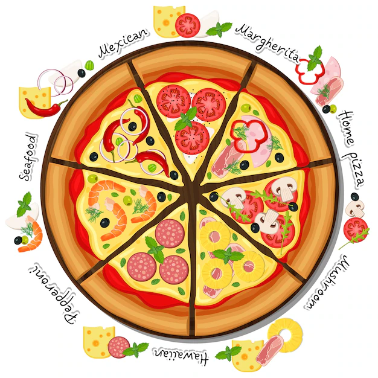

# Pizza Sales Analysis 
### Project Overview
This project involves analyzing sales data from a pizza chain to derive actionable insights and trends. The dataset includes information on pizza types, sales figures, customer preferences
### Project Objective
- Analyze sales patterns to identify popular pizza choices, peak sales periods, and customer preferences.
- Visualize findings through charts, graphs, and reports to facilitate easy interpretation.
### Data Source
Sales Data- Primary data source used here is "pizza_sales.csv" file containing the detailed information about each sale done by the company.
### Tools
 - SQL for validating the KPI's and other findings.
 - Powerbi for Data visualization and report building.
### Findings
- High volume of pizza orders are placed on weekends.
- Maximum orders are placed in July and January mostly holiday months.
- Classic pizza Category contributes to maximum Sales and total orders.
- when comes to pizza size,maximum number of Large size pizzas were sold out.
- Maximum revenue was generated by Thai Chicken Pizza.
- Minimum revenue was generated by Brie Carre Pizza.
### Suggestions
If we eliminate the lowest-selling pizza categories and introduce additional pizzas with ingredients or flavors similar to the most popular ones, we can anticipate a revenue boost for the company in the upcoming year.
